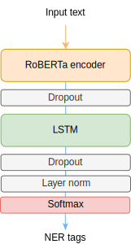

# NER task
It currently supports only English.

## DEPENDENCIES

```bash
pip install -r requirements.txt
```
## Model description



## LAUNCHING
(optional)
 ```bash
jupyter notebook 01_train_models.ipynb
```

Main program
```bash
python infer_model.py
```

## Script outputs
The script `infer_model.py` is an interactive CLI program.

After launching , you will be prompted to insert a sentence. The script outputs each inferred named entity for each token.


It includes a straightforward algorithm to reconstruct the original tokens by combining word-pieces, ensuring that each token is mapped to its corresponding entity.


## NOTES
`ray_gridsearch.py` was created for optimizing hyperparameters.

Always run your projects in a virtual environment.

## AUTHOR
bianca.ciobanica@student.uclouvain.be
